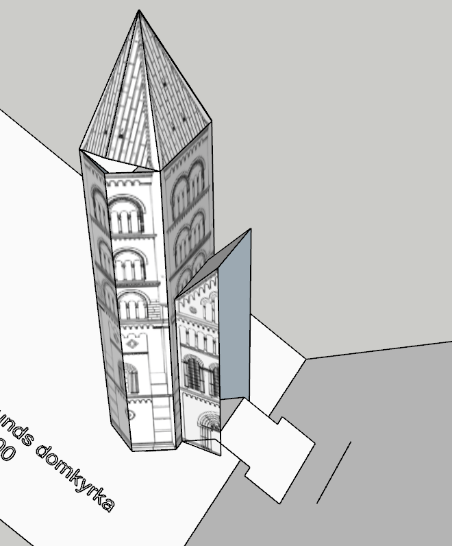

# Rotate to Plane

Rotate object to position a point perfectly on a plane.
This is an inference ("On Radius") that's missing in the native Rotate tool.

Streamlined to rotate pieces of paper in pop up models to the right angles, but
can also be used in more generic cases such as leaning a ladder against a wall.

# Scope

This tool is created and streamlined for paper pop up models, i.e. rotating
groups/components containing a face, along one of its edges, so one of its
endpoints lands on a given target plane. Often the target plane is
extrapolated from a non-vertical edge.

I have a bit of an inner conflict how generic vs specialized/streamlined this
tool should be. It could easily be made more generic by allowing:
- rotational plane to be picked from a hovered face,
- rotational plane to be picked from the ground plane and
- target plane to be picked from the ground plane.

However this would obfuscate the intended use case, making the tool less
intuitive and lead to questions such as:
- why is the tool at all picking the rotational axis from an edge
  (it's a rare use case but very nifty for paper pop up models),
- why is the tool assuming a vertical target plane from an edge
  (it's a rare use case but very nifty for paper pop up models),
- why is it drawing a circle and not a protractor like native Rotate tool
  (because it shows the radius intersections to the plane will be found at)?

For now compromise by limiting the tool a little bit, allow the drag+hold
pattern for custom directional input, and hope native SketchUp Rotate tool
one day adds a "From Radius" inference for the general use case.

Let this tool stay the paper pop up rotate tool.
